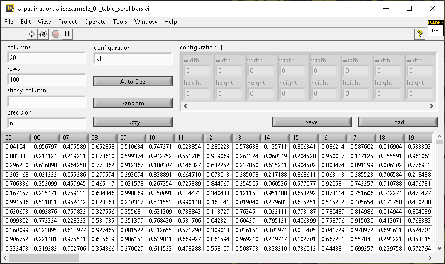
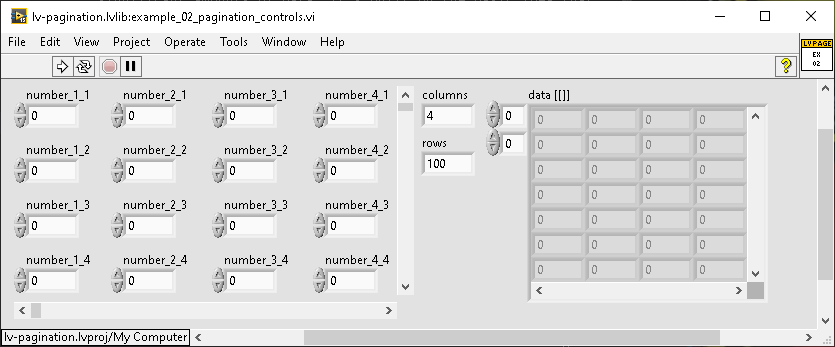

# lv-pagination

lv-pagination is a library that attempts to simplify common code that can be used to optimize memory usage when displaying significant amounts of data. It's built on the basic idea that it's more efficient to store an array of doubles rather than an array of strings. This library takes that idea  a step further and provides utilities that allow you to dynamically locate and "page" data such that you only load what can be "seen" into memory.

## Description

Although the examples for lv-pagination focus on converting doubles to strings and paging those values such that you only convert what you show, the real "secret sauce" is it's ability to dynamically calculate what cells are visible as well as being able to automatically resize the cells depending on the data within.

lv-pagination provides a handful of API:

* calculate_visible_rows_columns.vi - This VI will take a given listbox reference and calculate the visible columns and rows. If pad_visible is true, it'll increment the visible rows and columns by one.
* calculate_scrollbar_doc_max.vi - This VI will take the values of the visible rows/columns and the amount of data rows/columns and computer the document max for vertical and horizontal scrollbars. This is 100% dependent on the accuracy of calculating the visible rows.
* column_width_load.vi - This VI can be used to set the column width and row height of a listbox using the configuration input.
* column_width_save.vi - This VI can be used to save  the column width and row height of a listbox and outputting those values as configuration.
* paging_index.vi - This VI can be used to calculate the indexes of a static data set to use depending on the visible rows/columns and the values of the vertical/horizontal scrollbars.
* resize_table_columns.vi - This VI can be used to automatically determine the appropriate value for column width and row height depending on the contents of the cells themselves.

also a a couple of functional globals:

* fg_listbox_sizes.vi - This functional global provides a way to configure "padding" for calculating the visible cells, you can configure the line size (between cells) and the scrollbar size.
* fg_width_padding.vi - This functional global is used to pad the width of a given cell when re-sizing.

## Example 01 - Table Scrollbar

This example demonstrates how to use the auto-sizing library with different kinds of data. With the controls, you can determine how much data is generated (via rows/columns), the precision of the number to string conversion, as well as the precision when showed.

At it's most basic, this example shows how you can have a listbox control and use scrollbars to dynamically load the data for display purposes, but keep it in it's memory efficient form elsewhere.

Some other curious things about the demo:

* You can set it to generate random or sequential values, when set to sequential, it'll create a situation where the columns aren't all the same size, so the fuzzy versus actual visible column calculation will make a functional difference (try it!).
* The auto-size button can be used to show how sizing occurs with the different configuration with obvious results.
* Sticky column is interesting in that it works somewhat like Excel and although it's just for one column, I think the idea can be extended as needed.

Things to keep in mind:

* There's a lot of room for off-by-one errors, especially when displaying data, the sequential data makes it more clear if there's data missing from the calculations (fuzzy vs actual).

## Example 02 - Pagination Controls

This example shows how you can change the data for a static set of controls using scrollbars simlar to example 01.
